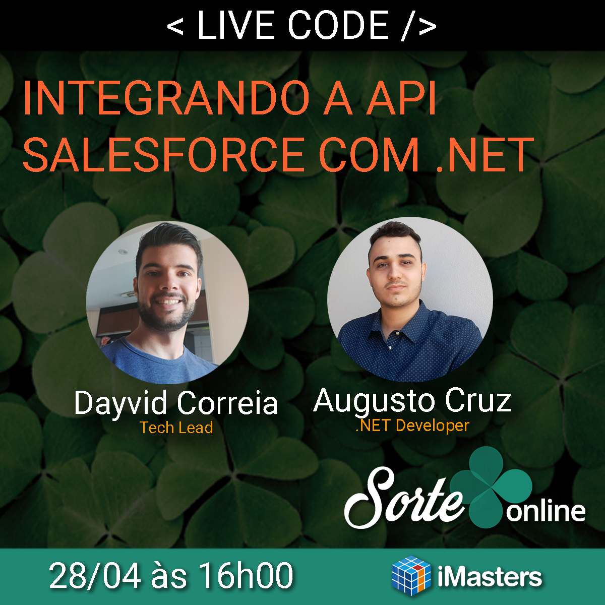

&nbsp;

## Projeto desenvolvido durante o Live Code da [Sorte Online](https://www.linkedin.com/company/sorte-online/mycompany/) em parceria com a [iMasters](https://imasters.com.br/) do dia 28/04/2021.
&nbsp;
## https://www.youtube.com/watch?v=TS3RxFSh6bM

&nbsp;

&nbsp;
&nbsp;
&nbsp;

## Para Rodar

&nbsp;

1) Adicione o Service Reference através do wsdl, lembrando de substituir seu subdomínio na url:
	`https://[YOUR_SUBDOMAIN].soap.marketingcloudapis.com/etframework.wsdl;`
	
2) No app.config incluir seu usuário e senha da API nas chaves do AppSettings (sfUser e sfPass);

3) Em `Program.cs` no método `GetSoapClient()` inclua seu subdomínio na url da criação do objeto EndpointAddress:
	https://[YOUR_SUBDOMAIN].soap.marketingcloudapis.com/Service.asmx;
	
4) Em `Program.cs` no método `GetTriggeredSendDefinition()` troque o valor de `definition.CustomerKey` pela External Key de sua Trigger criada no Marketing Cloud caso seja diferente;

5) Certificar-se que seu Data Extension criado no Marketing Cloud tenha os mesmo atributos declarados no método `GetSubscriberList()` da classe `Program.cs`;

6) Execute o projeto.

